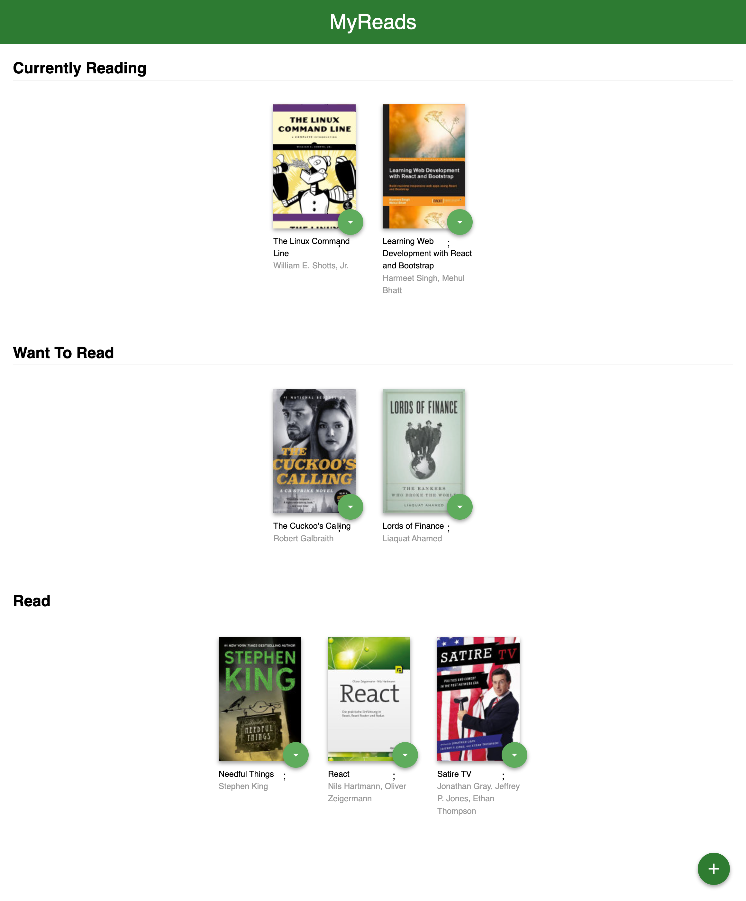
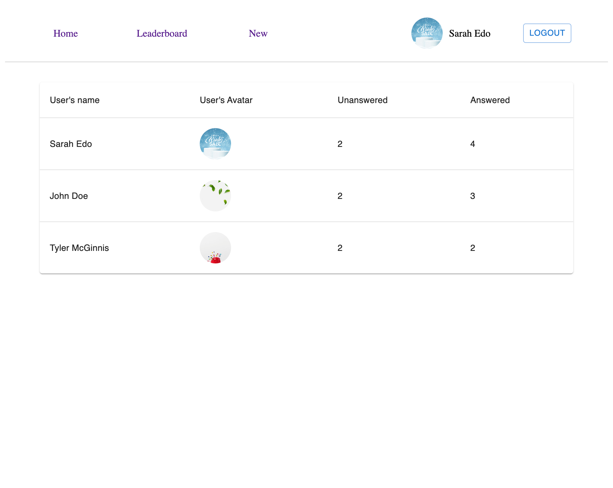

# Hi, My name is Teth! 👋

# Introduction
- I've 5 years working as Web Developer
- Due to the unique nature of each project, I adapt and utilize a diverse range of technologies to
  best meet its requirements.
- I can work with front-end, and back-end (Such as RoR, NodeJS, ReactJS, Angular JS, PostgreSQL, HTML5, SCSS, Bootstrap.)
- The primary technologies I specialize in for development are Ruby, NodeJS, and React

# Professional Summary

- Be familiar with Agile/Scrum methodologies.
- High sense of organization and responsibility
- Good at teamwork spirit.
- Strong willingness to learn.

<h2 align="center">🛠 Technologies and Tools 🛠</h2>
 

&nbsp;

&nbsp;

&nbsp;

&nbsp;

&nbsp;

&nbsp;

&nbsp;

&nbsp;

&nbsp;

&nbsp;

&nbsp;

&nbsp;

&nbsp;

&nbsp;

&nbsp;

&nbsp;

## 🌱 Currently Exploring

- 🚀 Learning Full Stack Web Development
  - Exploring the ins and outs of React and Redux for dynamic front-end experiences.
  - Navigating through the world of React Router for seamless page transitions.
  - Styling with Tailwind CSS to create modern and responsive user interfaces.
  - Building server-side applications with NodeJS, ExpressJS, and NestJS
  - Diving into PostgreSQL for efficient and scalable database management.

## 🏆 Achievements

- Udacity Intermediate Javascript <a href="https://learn.udacity.com/view-certificate/nd032" target="_blank">(View)</a>
- Udacity ReactJS <a href="https://learn.udacity.com/view-certificate/nd019" target="_blank">(View)</a>
- Udacity Fullstack Javascript Developer <a href="https://learn.udacity.com/view-certificate/nd0067" target="_blank">(View)</a>
- Udacity SQL <a href="https://learn.udacity.com/view-certificate/nd072" target="_blank">(View)</a>
- Professional Scrum Master I (PSMI)

# Git Dashboard

 

# 🏆 Projects

## 🚀 From Udacity FullStack Javascript Developer

### MyStore App

- Web App based on Angular 12 | Typescript | RxJS | Data JSON | HTML & CSS | Bootstrap | Karma - Jasmine | Responsive Design
   
  

## 🚀 From Udacity ReactJS

### MyReads A Book Tracking App

- Web pages based on React | ReactRouterDom | HTML & CSS | React Books Udacity API | React Hooks | Responsive Design
   
  
   
  

### Employee Polls Web App

- Web pages based on React 18 | Vite | Typescript | ReactRouterDom | MUI |
  | React-Redux | Redux Toolkits | DATA js file | Responsive Design
- Unit Test was written by Jest - testing-library/react - testing-library/dom - testing-library/jest-dom - react-test-renderers
- Also handle ErrorBoundary and PrivateRoute
   
  
   
  
   
  
   
  
   
  

 

## 🚀 From Udacity Intermediate Javascript

### Mars Dashboard

- Web App based on NodeJS | ExpressJS | NASA API Javascript | HTML & CSS | Responsive Design
   
  
   
  
   

### Dinosaurs

- Web page based on Javascript | HTML & CSS | Responsive Design
   
  
   

  
   

🌱🌱🌱 And more projects...

## 📬 Get in Touch

- Connect with me on <a href="https://www.linkedin.com/in/tai-nguyen-trung/" target="_blank">Linkdin</a>
- Or send message to my <a href="mailto:tai.nguyentrung1996@gmail.com" target="_blank">Email</a>

##### Thanks for reading! Let's connect and explore the fascinating world of technology together. 🚀🚀🚀

<h2 align="center">📑 My Favorites Quote 📑</h2>
 

<!--

Here are some ideas to get you started:

- 🔭 I’m currently working on ...
- 🌱 I’m currently learning ...
- 👯 I’m looking to collaborate on ...
- 🤔 I’m looking for help with ...
- 💬 Ask me about ...
- 📫 How to reach me: ...
- 😄 Pronouns: ...
- ⚡ Fun fact: ...
-->
